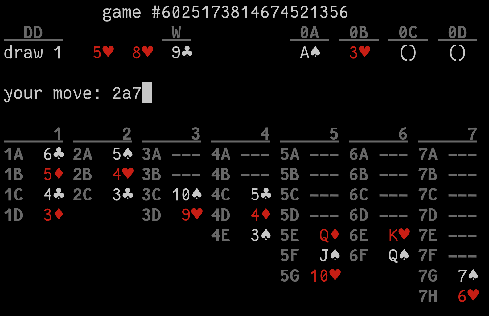

klon
====

`klon` is a text-mode [Klondike](https://en.wikipedia.org/wiki/Klondike_\(Solitaire\)) (aka Solitaire) card game implementation.

Why? Because everything's better in text mode.

Each playable card has an address:
  * The *waste*, the last face-up card drawn from the deck, is `W`.
  * The four *foundation* piles in the top-right, where you are trying to move
    your cards to, are `0A` thru `0D`.
  * The *tableau*, the main piles of cards in the bottom half of the screen,
    are numbered by column, 1 thru 7, and each position is lettered. When the
    game begins, these are `1A` thru `7G`.

To move a card, enter a source followed by a destination.
  * To move an entire stack of cards, or a part of a stack, name the card at
    top of the stack you want to move. The ones stacked below it will move with
    it.
  * To move to the bottom of a tableau column, just enter the column number,
    without any row letter.
  * As a shortcut, to move a card to the foundation, because it can only go in
    one place, you can omit the destination and the game will do the correct
    thing.

To flip over a card that is face-down, just enter that card's address, without
any destination.

To draw three cards from the deck into the waste, enter `DD`. When the deck has
been exhausted, this will recycle all the waste cards back into the deck in the
same order, to be dealt again.

If you want to take back a move, type `undo`.

When you start `klon` without any command-line arguments, it randomizes the
deck, but it gives you a "game number" that can be used to generate that same
deck again. Run `klon` with that number as an argument to play it again.

`klon` keeps a record of the moves you've made. You can write it to a file by
typing `log <filename>`. You can load that file and replay the moves in it by
typing `load <filename>`. The first line of the log file says what game number
it is for.
